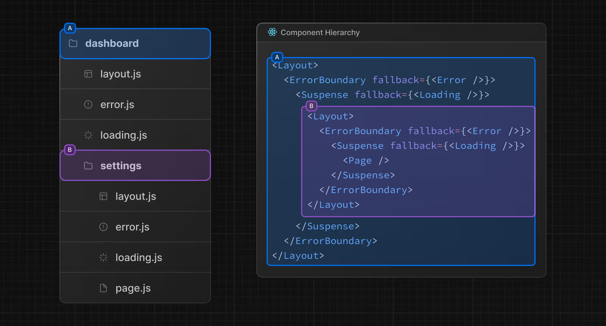

## Next.js App Router — Fichiers spéciaux

Ce document explique le rôle de chaque fichier spécial du App Router Next.js et comment ils s'imbriquent dans ce projet.

---

### Vue d'ensemble — Hiérarchie des fichiers



_Voir la [documentation officielle Next.js](https://nextjs.org/docs/app/getting-started/project-structure) pour plus de détails._

Next.js wrap automatiquement chaque page dans cet ordre :

```
<Layout>
  <ErrorBoundary>       ← error.tsx
    <Suspense>          ← loading.tsx
      <Page />          ← page.tsx
    </Suspense>
  </ErrorBoundary>
</Layout>
```

> **Image** : _(à ajouter)_

---

### `layout.tsx` — Structure persistante

**Rôle** : enveloppe les pages enfants avec une structure commune (sidebar, navbar, etc.).

**Caractéristique clé** : le layout **ne se recharge pas** lors de la navigation entre pages du même groupe. L'état (scroll, données) est préservé.

```tsx
// src/app/(website)/dashboard/layout.tsx
export default function DashboardLayout({ children }: { children: React.ReactNode }) {
  return (
    <div className="flex">
      <AppSidebar />
      <main>{children}</main>
    </div>
  );
}
```

**Dans ce projet** :

- `dashboard/layout.tsx` → layout avec `AppSidebar` (fond sombre)
- `account/layout.tsx` → layout avec `UserSidebar` (fond blanc)

---

### `loading.tsx` — Skeleton pendant le chargement SSR

**Rôle** : affiché pendant que Next.js exécute les `fetch()` serveur de la page.

**Quand apparaît-il ?**

- L'utilisateur navigue vers une page avec du SSR → le skeleton s'affiche immédiatement
- Le serveur stream le vrai contenu dès que les données sont prêtes
- Sans ce fichier : écran blanc jusqu'à la fin de tous les fetch

**Fonctionnement interne** : Next.js wrap automatiquement `page.tsx` dans un `<Suspense fallback={<Loading />}>`.

```tsx
// src/app/(website)/dashboard/loading.tsx
import { Skeleton } from "@/components/ui/skeleton";

export default function DashboardLoading() {
  return (
    <div className="p-6 space-y-8">
      <Skeleton className="h-40 w-full rounded-2xl" />
      <div className="grid grid-cols-4 gap-4">
        {Array.from({ length: 4 }).map((_, i) => (
          <Skeleton key={i} className="h-28 rounded-2xl" />
        ))}
      </div>
    </div>
  );
}
```

**Pages avec `loading.tsx` dans ce projet** :

| Route                               | Raison                                        |
| ----------------------------------- | --------------------------------------------- |
| `/dashboard`                        | 3 fetch en parallèle (users, posts, comments) |
| `/dashboard/users/[id]`             | Fetch SSR par ID                              |
| `/dashboard/users/edit/[id]`        | Fetch SSR pour pré-remplir le formulaire      |
| `/dashboard/posts/[id]`             | Fetch SSR par ID                              |
| `/dashboard/posts/edit/[id]`        | Fetch SSR pour pré-remplir le formulaire      |
| `/dashboard/comments/[id]`          | Fetch SSR par ID                              |
| `/dashboard/comments/edit/[id]`     | Fetch SSR pour pré-remplir le formulaire      |
| `/account/profile`                  | Fetch des données de profil                   |
| `/account/settings/change-password` | Chargement du formulaire serveur              |

> **Note** : les pages list (`/dashboard/users`, `/dashboard/posts`, etc.) utilisent React Query côté client — elles gèrent leur propre loading state, pas besoin de `loading.tsx`.

#### Quand NE PAS mettre de `loading.tsx`

Deux cas où `loading.tsx` est inutile :

**1. Page list avec React Query (client-side)**

```ts
// dashboard/users/page.tsx — aucun fetch SSR
export default function UsersPage() {
  return <UserList />; // composant client, React Query fetch après le rendu
}
```

La page SSR s'affiche instantanément. C'est le `DataTable` interne qui gère son propre skeleton via `loading={isLoading}`.

**2. Formulaire vide (create)**

```ts
// dashboard/users/create/page.tsx — aucun fetch SSR
export default function CreatePage() {
  return <UserCreateForm />; // formulaire vide, rien à charger côté serveur
}
```

Aucune donnée à attendre → la page s'affiche immédiatement.

#### Règle simple

```
loading.tsx ✓  →  page avec await fetch() SSR  (ex: [id], edit/[id])
loading.tsx ✗  →  page client React Query      (ex: liste)
loading.tsx ✗  →  formulaire vide              (ex: create)
```

---

### `error.tsx` — Écran d'erreur

**Rôle** : affiché si une erreur est `throw` dans la page ou ses composants enfants.

**Règle obligatoire** : doit être un **Client Component** (`"use client"`) car il reçoit un objet `Error` et une fonction `reset()`.

```tsx
// src/app/(website)/dashboard/error.tsx
"use client";

import { ErrorPage } from "@/components/features/error-page";

export default function DashboardError({
  error,
  reset,
}: {
  error: Error & { digest?: string };
  reset: () => void;
}) {
  return <ErrorPage error={error} reset={reset} />;
}
```

**`reset()`** : relance le rendu de la page sans rechargement complet.

**Dans ce projet** :

- `src/app/error.tsx` → erreur globale (toute l'app)
- `src/app/(website)/dashboard/error.tsx` → erreurs du dashboard uniquement
- `src/app/(website)/account/error.tsx` → erreurs de l'espace compte

---

### `not-found.tsx` — Page 404

**Rôle** : affiché quand `notFound()` est appelé dans une page serveur.

```tsx
// src/app/(website)/dashboard/users/[id]/page.tsx
const res = await fetchUserById(id);
if (!res.ok) notFound(); // → déclenche not-found.tsx le plus proche
```

```tsx
// src/app/(website)/dashboard/not-found.tsx
import { NotFound } from "@/components/features/not-found";

export default function DashboardNotFound() {
  return (
    <NotFound
      title="Ressource introuvable"
      message="La ressource que vous recherchez n'existe pas ou a été supprimée."
      backHref="/dashboard"
      backLabel="Retour au tableau de bord"
    />
  );
}
```

**Cascade** : Next.js cherche le `not-found.tsx` le plus proche dans l'arborescence, puis remonte vers la racine.

**Dans ce projet** :

- `src/app/not-found.tsx` → 404 global
- `src/app/(website)/dashboard/not-found.tsx` → ressources dashboard introuvables
- `src/app/(website)/account/not-found.tsx` → pages compte introuvables

---

### `template.tsx` — Layout qui se recrée (rare)

**Rôle** : identique à `layout.tsx` mais **recrée une nouvelle instance** à chaque navigation.

**Quand l'utiliser** :

- Animations d'entrée/sortie de page (chaque navigation = animation fraîche)
- Tracking analytics par page view
- Reset d'état entre navigations

**Dans ce projet** : non utilisé. `layout.tsx` est suffisant dans la quasi-totalité des cas.

```tsx
// Exemple — animation d'entrée à chaque navigation
export default function Template({ children }: { children: React.ReactNode }) {
  return <div className="animate-fade-in">{children}</div>;
}
```

---

### Faut-il un `loading.tsx` sur chaque `page.tsx` ?

**Non.** Seulement là où l'utilisateur peut percevoir une attente.

#### Règle de décision rapide

| Type de page                           | `loading.tsx` ? | Pourquoi                    |
| -------------------------------------- | --------------- | --------------------------- |
| `async` avec fetch API/DB              | ✅ Oui          | Peut bloquer 200ms–2s       |
| `async` avec `Promise.all` multiple    | ✅ Oui          | Cumule les temps de fetch   |
| Client Component (`useSession`, hooks) | ❌ Non          | Ne se déclenche jamais      |
| Page statique (aucun `await`)          | ❌ Non          | Rendu instantané            |
| Formulaire vide (create)               | ❌ Non          | Rien à charger côté serveur |

#### Dans ce projet

```
dashboard/               → ✅ loading.tsx  (3 fetch parallèles)
dashboard/users/[id]     → ✅ loading.tsx  (fetch par ID)
dashboard/users/edit/    → ✅ loading.tsx  (fetch pour pré-remplir)
account/                 → ✅ loading.tsx  (page SSR + dev delay)
dashboard/users/         → ❌ pas de loading.tsx  (React Query client)
dashboard/users/create/  → ❌ pas de loading.tsx  (formulaire vide)
```

#### La règle

```
page.tsx a un await fetch()  →  ajoute loading.tsx
page.tsx sans await          →  ne l'ajoute pas
```

---

### Résumé — Quand utiliser quoi

| Fichier         | Quand l'ajouter                                            |
| --------------- | ---------------------------------------------------------- |
| `layout.tsx`    | Toujours — structure commune à un groupe de routes         |
| `loading.tsx`   | Uniquement si la page a un `await fetch()` SSR             |
| `error.tsx`     | Sur chaque section critique (dashboard, account)           |
| `not-found.tsx` | Sur chaque section avec des ressources dynamiques (`[id]`) |
| `template.tsx`  | Rarement — animations de page ou analytics                 |

---

---

### `LoadingPage` vs `loading.tsx` vs `DataTable` — Lequel utiliser ?

Ce projet dispose de trois mécanismes de loading différents. Chacun a un rôle précis.

#### Les 3 mécanismes

| Mécanisme                       | Type                             | Quand s'affiche-t-il                     |
| ------------------------------- | -------------------------------- | ---------------------------------------- |
| `loading.tsx`                   | Skeleton plein écran             | Navigation vers une page SSR             |
| `DataTable loading={isLoading}` | Skeleton inline dans le tableau  | Fetch initial React Query (client)       |
| `LoadingPage`                   | Overlay plein écran avec spinner | Mutation en cours (create, edit, delete) |

#### Règle simple

```
Fetch initial   → DataTable ou loading.tsx (selon SSR ou React Query)
Mutation        → LoadingPage
```

#### Pourquoi ne pas mettre `LoadingPage` sur les listes ?

Les pages list (`/dashboard/users`, `/dashboard/posts`, `/dashboard/comments`) utilisent **React Query** côté client. Le `DataTable` reçoit déjà `loading={isLoading}` et affiche ses propres lignes skeleton :

```tsx
// DataTable gère déjà ça — pas besoin de LoadingPage
<DataTable columns={columns} data={posts} loading={isLoading} />
```

Ajouter `LoadingPage loading={isLoading}` en plus crée un **double loading** : l'overlay cache le tableau qui fait déjà son propre skeleton. C'est redondant et mauvais UX.

#### Où `LoadingPage` est correctement utilisé

Sur les mutations qui bloquent l'UI (formulaires create/edit) :

```tsx
// post-create-form.tsx ou post-edit-form.tsx
const { mutate, isPending } = useCreatePost();

return (
  <>
    <LoadingPage loading={isPending} text="Création en cours..." />
    <form onSubmit={handleSubmit}>...</form>
  </>
);
```

Ici l'overlay est justifié : l'utilisateur ne doit pas interagir pendant que la mutation s'exécute.

#### Résumé dans ce projet

| Composant               | Mécanisme correct                 | Raison                       |
| ----------------------- | --------------------------------- | ---------------------------- |
| `UserList`              | `DataTable loading={isLoading}`   | React Query, skeleton inline |
| `PostList`              | `DataTable loading={isLoading}`   | React Query, skeleton inline |
| `CommentList`           | `DataTable loading={isLoading}`   | React Query, skeleton inline |
| `dashboard/page.tsx`    | `loading.tsx`                     | SSR avec 3 fetch parallèles  |
| `users/[id]/page.tsx`   | `loading.tsx`                     | SSR fetch par ID             |
| Formulaires create/edit | `LoadingPage loading={isPending}` | Mutation bloquante           |

---

### Portée des fichiers

Un fichier s'applique à **toute la sous-arborescence** depuis son dossier :

```
dashboard/
  loading.tsx        ← s'applique à /dashboard et tous ses enfants
  error.tsx          ← idem
  users/
    [id]/
      loading.tsx    ← remplace le parent pour /dashboard/users/[id] uniquement
      page.tsx
```

Le fichier le plus proche dans l'arbre a la priorité.

---

### `process.env.NODE_ENV` — Variables d'environnement Next.js

`process.env.NODE_ENV` est une variable automatiquement définie par Next.js selon comment tu lances l'application :

| Commande                      | Valeur          |
| ----------------------------- | --------------- |
| `npm run dev`                 | `"development"` |
| `npm run build` + `npm start` | `"production"`  |

**Utilité** : exécuter du code uniquement en développement, sans impacter la production.

```ts
if (process.env.NODE_ENV === "development") {
  // Ce bloc est ignoré en production
  await new Promise((resolve) => setTimeout(resolve, 3000));
}
```

#### Cas concret — tester les `loading.tsx`

Les API locales répondent souvent trop vite pour voir les skeletons. On ajoute un délai artificiel dev-only dans la page SSR :

```ts
// app/(website)/dashboard/page.tsx
export default async function DashboardPage() {
  if (process.env.NODE_ENV === "development") {
    await new Promise((resolve) => setTimeout(resolve, 3000)); // ← retire quand plus besoin
  }

  const [usersRes, postsRes, commentsRes] = await Promise.all([...]);
}
```

En production (`npm run build`), ce `if` est entièrement ignoré par Next.js — les utilisateurs ne subissent aucun délai.

---

### SSR fetch vs React Query — Lequel choisir pour `[id]` et `edit/[id]` ?

Pour les pages de détail et d'édition, deux approches sont valides. Ce projet utilise le **SSR fetch**.

#### Option 1 — SSR fetch (approche actuelle)

```tsx
// page.tsx (Server Component)
const res = await fetchUserById(Number(id));
if (!res.ok) notFound(); // vrai 404 HTTP côté serveur
return <UserEditForm loadedUser={res.data} />;
```

✅ Formulaire pré-rempli immédiatement — pas de flash de champs vides
✅ `notFound()` propre côté serveur
✅ `loading.tsx` gère le skeleton naturellement
❌ Pas de cache — re-fetch à chaque navigation
❌ TTFB plus lent (user attend avant de voir quoi que ce soit)

#### Option 2 — React Query avec ID passé au composant

```tsx
// page.tsx (Server Component)
return <UserEditForm id={id} />;

// UserEditForm (Client Component)
const { data, isLoading } = useUserById(id);
if (isLoading) return <Skeleton />;
```

✅ **Cache** — si l'user vient de la liste, données instantanées
✅ Pattern cohérent avec le reste du dashboard (React Query)
✅ Navigation back/forward sans re-fetch
❌ `notFound()` doit être géré côté client (moins propre)
❌ Flash de skeleton au premier chargement

#### Règle de décision

| Contexte                          | Approche recommandée  |
| --------------------------------- | --------------------- |
| Page publique (SEO)               | SSR fetch             |
| Dashboard authentifié             | Les deux fonctionnent |
| Besoin d'un vrai 404 HTTP         | SSR fetch             |
| Cohérence totale avec React Query | React Query + ID      |

> **Dans ce projet** : SSR fetch est utilisé car il simplifie la gestion du 404 et garde `loading.tsx` fonctionnel. Les deux approches sont des best practices selon le contexte.

---

## SSR vs Client Components — Meilleure pratique pour `page.tsx`

### Règle d'or

**Les `page.tsx` doivent TOUJOURS être SSR (pas de `"use client"`)**

---

### Pourquoi SSR pour `page.tsx` ?

#### 1️⃣ Métadonnées (metadata, openGraph, etc.)

Les métadonnées **ne fonctionnent QUE sur les Server Components** :

```tsx
// ✅ Bon — page.tsx SSR
export const metadata = { title: "Mon profil", description: "Voir mon profil" };

export default async function ProfilePage() {
  return <ProfileDetail />;
}
```

```tsx
// ❌ Mauvais — page.tsx avec "use client"
"use client";

// metadata est ignoré par Next.js !
export const metadata = { title: "Mon profil" };
export default function ProfilePage() {
  return <ProfileDetail />;
}
```

#### 2️⃣ Performance

- **SSR** : serveur exécute les fetch, envoie le HTML au navigateur
- **Client Component** : navigateur télécharge le JS, exécute le fetch, attend la réponse → écran blanc

```tsx
// Temps until Interactive
SSR:          réseau + rendu serveur + hydratation = RAPIDE
"use client":  JS + fetch client + rendu client = 30-50% plus lent
```

#### 3️⃣ `async` dans la fonction racine

Seuls les **Server Components** peuvent utiliser `async` :

```tsx
// ✅ SSR
export default async function UserPage({ params }) {
  const user = await fetch(`/api/users/${params.id}`);
  return <UserDetail user={user} />;
}
```

```tsx
// ❌ "use client" ne supporte pas async
"use client";

export default function UserPage({ params }) {
  // ❌ SyntaxError — tu ne peux PAS faire ça
  // const user = await fetch(...);

  // Obligation d'utiliser useEffect ou React Query
  useEffect(() => {
    // fetch ici au lieu du serveur
  }, []);
}
```

---

### Pattern correct — SSR page.tsx + loading.tsx

**Solution** : garder `page.tsx` SSR avec un composant client simple (sans `isLoading`), et laisser `loading.tsx` gérer le skeleton.

#### ❌ Mauvais (avec `isLoading` dans le composant)

```tsx
// ❌ Complexe et redondant
"use client";

export function AccountContent() {
  const { user, isLoading } = useSession();

  if (isLoading) {
    return <Skeleton className="h-40" />; // Skeleton dans le composant
  }

  if (!user) return null;
  return <UserInfo user={user} />;
}
```

#### ✅ Bon (avec `loading.tsx`)

**1. Garder `page.tsx` SSR simple :**

```tsx
// app/(website)/account/page.tsx — SSR
export const metadata = {
  title: "Mon compte",
  description: "Gérez votre compte",
};

export default async function AccountPage() {
  if (process.env.NODE_ENV === "development") {
    await new Promise((resolve) => setTimeout(resolve, 3000));
  }

  return <AccountContent />;
}
```

**2. Composant client simple (sans logique de loading) :**

```tsx
// components/features/account/account-content.tsx — Client Component
"use client";

import { useSession } from "@/lib/auth/context/auth.user.context";

export function AccountContent() {
  const { user } = useSession();

  if (!user) return null;

  return (
    <div className="min-h-screen p-6 space-y-6 max-w-7xl mx-auto">{/* Contenu du compte */}</div>
  );
}
```

**3. Ajouter `loading.tsx` au même niveau que `page.tsx` :**

```tsx
// app/(website)/account/loading.tsx
import { Skeleton } from "@/components/ui/skeleton";

export default function AccountLoading() {
  return (
    <div className="min-h-screen p-6 space-y-6 max-w-7xl mx-auto">
      <Skeleton className="h-40 w-full rounded-2xl" />
      <div className="grid grid-cols-1 md:grid-cols-2 gap-6">
        <Skeleton className="h-36 rounded-2xl" />
        <Skeleton className="h-36 rounded-2xl" />
      </div>
      <Skeleton className="h-48 rounded-2xl" />
    </div>
  );
}
```

---

### Pourquoi pas d'`isLoading` dans le composant client ?

Parce que **`loading.tsx` s'affiche AVANT le rendu du composant**.

La hiérarchie Next.js :

```
<Suspense fallback={<loading.tsx>}>
  <AccountContent /> ← ne se rend que si les fetch SSR sont terminés
</Suspense>
```

Le composant client ne reçoit l'utilisateur que quand tout est prêt → pas besoin de gérer `isLoading`.

---

### Avantages du pattern SSR + `loading.tsx`

| Aspect                 | SSR + `loading.tsx`         | Client avec `isLoading`   |
| ---------------------- | --------------------------- | ------------------------- |
| **Skeleton affichage** | ✅ Immédiat via Suspense    | ❌ Après hydratation JS   |
| **Complexité**         | ✅ Composant simple         | ❌ États à gérer          |
| **Performance**        | ✅ Rapide (SSR + streaming) | ❌ Plus lent (JS d'abord) |
| **Fallback**           | ✅ Dédié à `loading.tsx`    | ❌ Mélangé au composant   |

---

### Résumé

```
page.tsx (SSR)         → exécute les fetch
  ↓
loading.tsx            → affiche le skeleton pendant le SSR
  ↓
AccountContent (client) → reçoit les données, sans logique de loading
```

C'est plus simple et plus performant que d'avoir `isLoading` dans le composant.
