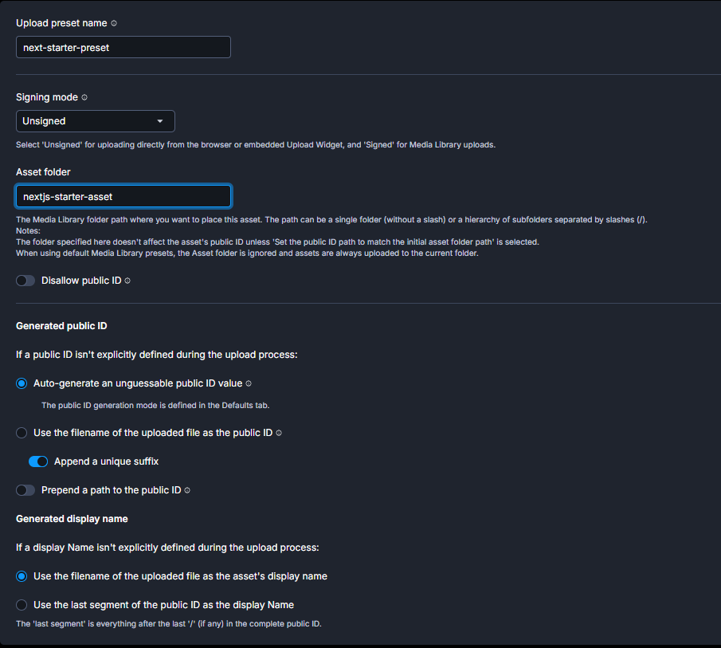

# Cloudinary — Guide d'intégration

Intégration via **next-cloudinary** (library officielle) + **Server Action** pour la suppression.

- Upload : `CldUploadWidget` → direct browser → Cloudinary (pas de serveur intermédiaire)
- Affichage : `CldImage` → Next.js `<Image>` + transformations Cloudinary
- Suppression : `deleteImageAction` (Server Action, utilise le SDK `cloudinary`)

---

## 1. Créer un compte Cloudinary

Aller sur [https://cloudinary.com](https://cloudinary.com) → **Sign Up** (plan gratuit suffisant).

---

## 2. Récupérer les credentials

Dashboard → **Product Environment Credentials** :

| Variable                            | Où la trouver          |
| ----------------------------------- | ---------------------- |
| `NEXT_PUBLIC_CLOUDINARY_CLOUD_NAME` | Dashboard (Cloud name) |
| `NEXT_PUBLIC_CLOUDINARY_API_KEY`    | Dashboard              |
| `CLOUDINARY_API_SECRET`             | Dashboard → "Reveal"   |

---

## 3. Créer un Upload Preset (obligatoire pour l'upload)

1. Dashboard → **Settings** → **Upload** → onglet **Upload presets**
2. **Add upload preset**
3. Configurer selon le screenshot ci-dessous
4. **Save** → copier le nom du preset dans `.env.local`

### Configuration du preset



| Champ                      | Valeur                                         | Pourquoi                                                                               |
| -------------------------- | ---------------------------------------------- | -------------------------------------------------------------------------------------- |
| **Upload preset name**     | `next-starter-preset`                          | Nom utilisé dans `NEXT_PUBLIC_CLOUDINARY_UPLOAD_PRESET`                                |
| **Signing mode**           | `Unsigned`                                     | Obligatoire pour l'upload direct depuis le browser via `CldUploadWidget`               |
| **Asset folder**           | `nextjs-starter-asset`                         | Dossier par défaut dans la Media Library (overridé par l'option `folder` du composant) |
| **Disallow public ID**     | OFF                                            | Le widget peut passer un publicId si besoin                                            |
| **Generated public ID**    | `Auto-generate an unguessable public ID value` | ID unique et sécurisé auto-généré                                                      |
| **Generated display name** | `Use the filename of the uploaded file`        | Nom lisible dans la Media Library                                                      |

---

## 4. Variables d'environnement

Les placeholders sont dans `env/.env.local` — remplir les valeurs réelles :

```env
# Cloudinary (next-cloudinary)
NEXT_PUBLIC_CLOUDINARY_CLOUD_NAME=your_cloud_name
NEXT_PUBLIC_CLOUDINARY_API_KEY=your_api_key
CLOUDINARY_API_SECRET=your_api_secret
NEXT_PUBLIC_CLOUDINARY_UPLOAD_PRESET=next-starter-preset
CLOUDINARY_UPLOAD_FOLDER=nextjs-starter-asset

# Optional — laisser vide si pas de CDN custom
NEXT_PUBLIC_CLOUDINARY_SECURE_DISTRIBUTION=
NEXT_PUBLIC_CLOUDINARY_PRIVATE_CDN=false
```

> `NEXT_PUBLIC_` = accessible browser + serveur
> Sans préfixe (`CLOUDINARY_API_SECRET`) = serveur uniquement

Puis copier vers `.env` :

```bash
npm run env
```

---

## 5. Packages installés

```bash
npm install next-cloudinary   # CldImage, CldUploadWidget, etc.
npm install cloudinary         # SDK serveur pour deleteImageAction
```

---

## 6. Fichiers de l'intégration

```
src/lib/cloudinary/
├── cloudinary.config.ts     # Config SDK cloudinary (server-only, delete uniquement)
├── cloudinary.model.ts      # Types CloudinaryUploadResult, CloudinaryActionError
└── cloudinary.actions.ts    # Server Action: deleteImageAction

src/components/ui/
└── image-upload.tsx         # Composant <ImageUpload /> (single + multiple)
```

---

## 7. Composant `<ImageUpload />`

### Mode single (1 image)

```tsx
import { ImageUpload } from "@/components/ui/image-upload";

const [imageUrl, setImageUrl] = useState("");
const [imagePublicId, setImagePublicId] = useState("");

<ImageUpload
  value={imageUrl}
  publicId={imagePublicId}
  onChange={(url, publicId) => {
    setImageUrl(url);
    setImagePublicId(publicId);
  }}
  onRemove={() => {
    setImageUrl("");
    setImagePublicId("");
  }}
  variant="light" // "light" | "dark"
/>;
```

### Mode multiple (plusieurs images)

```tsx
import { ImageUpload, UploadedImage } from "@/components/ui/image-upload";

const [images, setImages] = useState<UploadedImage[]>([]);

<ImageUpload multiple values={images} onChange={setImages} variant="light" />;
```

### Props communes

| Prop      | Type                | Défaut    | Description                       |
| --------- | ------------------- | --------- | --------------------------------- |
| `folder`  | `string`            | env var   | Dossier Cloudinary cible          |
| `variant` | `"light" \| "dark"` | `"light"` | Style selon le fond du formulaire |

### Props mode single

| Prop       | Type                                      | Description                      |
| ---------- | ----------------------------------------- | -------------------------------- |
| `value`    | `string?`                                 | URL de l'image actuelle (aperçu) |
| `publicId` | `string?`                                 | public_id pour suppression       |
| `onChange` | `(url: string, publicId: string) => void` | Appelé après upload réussi       |
| `onRemove` | `() => void`                              | Appelé après suppression         |

### Props mode multiple

| Prop       | Type                                | Description                       |
| ---------- | ----------------------------------- | --------------------------------- |
| `values`   | `UploadedImage[]`                   | Liste des images actuelles        |
| `onChange` | `(images: UploadedImage[]) => void` | Appelé à chaque ajout/suppression |

---

## 8. Server Action disponible

```ts
import { deleteImageAction } from "@/lib/cloudinary/cloudinary.actions";

const result = await deleteImageAction("nextjs-starter-asset/mon-image-xyz");
if (result.ok) console.log("Supprimée");
// result.error.detail en cas d'erreur
```

---

## 9. Afficher une image avec `CldImage`

`CldImage` = `next/image` + transformations Cloudinary inline. Utiliser `publicId` directement.

```tsx
import { CldImage } from "next-cloudinary";

<CldImage
  src={publicId} // public_id Cloudinary (ex: "nextjs-starter-asset/abc123")
  alt="Description"
  width={400}
  height={400}
  crop="fill" // recadrage
  gravity="face" // centrer sur le visage
  quality="auto" // qualité automatique
  format="auto" // WebP si supporté
/>;
```

Transformations utiles :

| Prop      | Valeurs courantes              | Effet             |
| --------- | ------------------------------ | ----------------- |
| `crop`    | `"fill"`, `"thumb"`, `"scale"` | Mode de recadrage |
| `gravity` | `"face"`, `"center"`, `"auto"` | Point focal       |
| `quality` | `"auto"`, `1-100`              | Qualité           |
| `format`  | `"auto"`, `"webp"`, `"avif"`   | Format de sortie  |

---

## 10. Checklist de mise en place

- [ ] Compte Cloudinary créé
- [ ] Upload Preset `next-starter-preset` créé (mode `Unsigned`, voir screenshot section 3)
- [ ] `env/.env.local` rempli avec les vraies valeurs + `npm run env`
- [ ] Tester : `npm run dev` → uploader une image via `<ImageUpload />`
